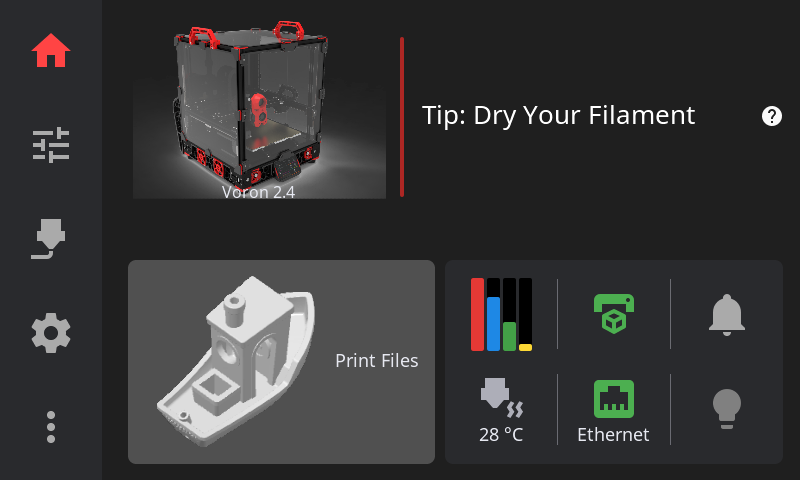
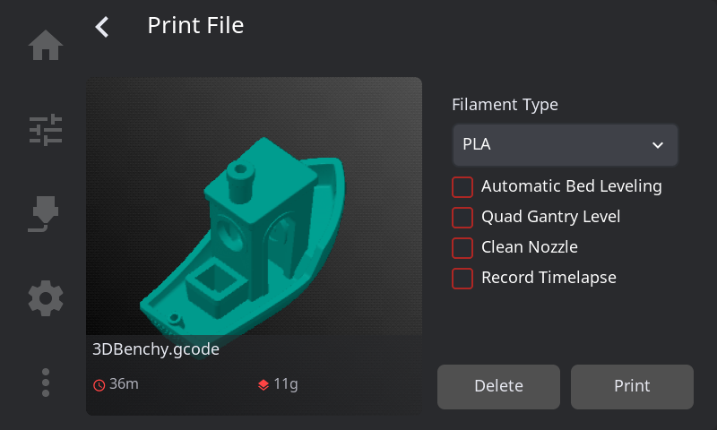
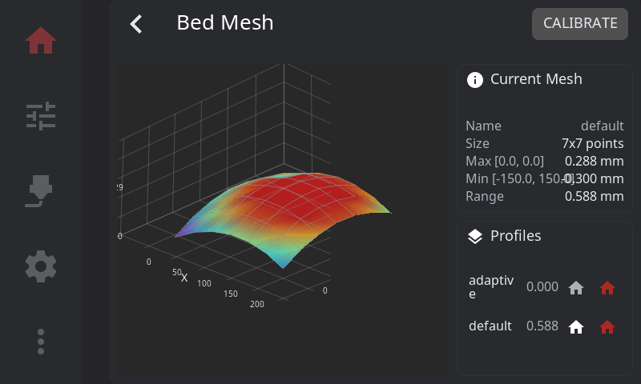
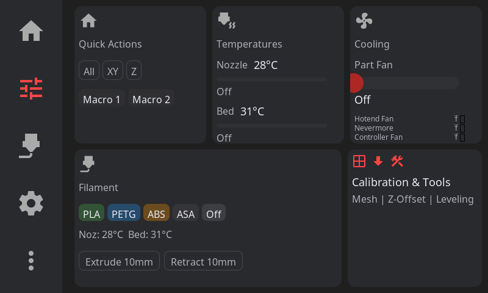
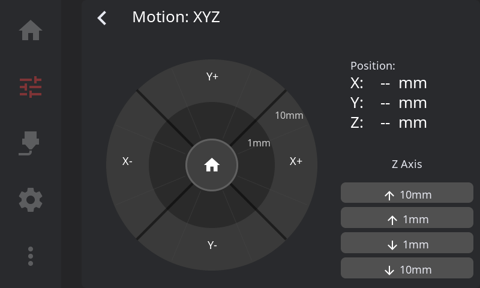
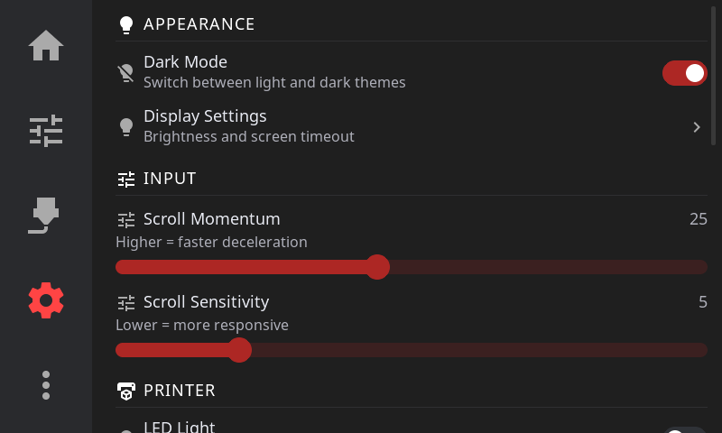
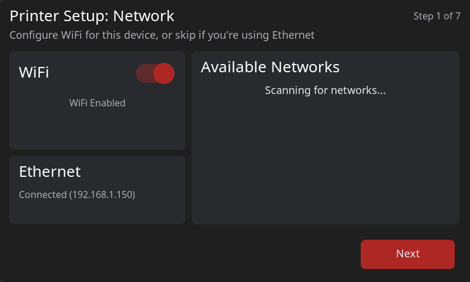

<p align="center">
  
  <br>
  <h1 align="center">HelixScreen</h1>
  <p align="center"><em>A modern touch interface for Klipper/Moonraker 3D printers</em></p>
  <p align="center"><a href="https://helixscreen.org">helixscreen.org</a></p>
</p>

<p align="center">
  <a href="https://github.com/prestonbrown/helixscreen/actions/workflows/build.yml"></a>
  <a href="https://github.com/prestonbrown/helixscreen/actions/workflows/quality.yml"></a>
  <a href="https://www.gnu.org/licenses/gpl-3.0"></a>
  <a href="https://lvgl.io/"></a>
  
  <a href="https://github.com/prestonbrown/helixscreen/releases"></a>
  <a href="https://discord.gg/RZCT2StKhr"></a>
</p>

Your printer can do way more than your current touchscreen lets you. Bed mesh visualization, input shaper graphs, multi-material management, print history — it's all trapped in a browser tab. HelixScreen puts it at your fingertips.

Fast, beautiful, and built for every Klipper printer — from a Creality K1 to a tricked-out Voron or RatRig.

---

> **Beta — v0.13**
>
> Core features are complete and stabilizing. We're looking for testers across different printer setups.
>
> **Tested on:** Voron 2.4 (Raspberry Pi 5), Voron 0.2, Doron Velta, RatRig V-Core, Flashforge AD5M Pro ([Forge-X](https://github.com/DrA1ex/ff5m) firmware), QIDI Q1 Pro, Sovol SV06, Sovol SV08
>
> **Raspberry Pi:** Both 64-bit and 32-bit Raspberry Pi OS are supported (Pi 4, Pi 5, CM4, Zero 2 W).
>
> **QIDI:** Supported with auto-detection heuristics and print start profile.
>
> **Flashforge:** AD5M/Pro (Forge-X firmware), AD5X (ZMOD firmware).
>
> **Creality:** K1/K1C/K1 Max binaries are included. K2 Plus build target exists (ARM, static musl) but is **untested** — if you have one, we'd love your help!
>
> **Snapmaker U1:** Cross-compile target with 480x320 display support.
>
> **Ready to help?** See [Installation](#installation). Found a bug? [Open an issue](https://github.com/prestonbrown/helixscreen/issues). Have an idea? [Request a feature](https://github.com/prestonbrown/helixscreen/issues/new?labels=enhancement). Want to chat? [Join our Discord](https://discord.gg/RZCT2StKhr).

---

**Quick Links:** [Website](https://helixscreen.org) · [Features](#features) · [Screenshots](#screenshots) · [Installation](#installation) · [User Guide](docs/user/USER_GUIDE.md) · [FAQ](#faq) · [Contributing](docs/devel/DEVELOPMENT.md#contributing) · [Changelog](CHANGELOG.md) · [Discord](https://discord.gg/RZCT2StKhr)

---

## Why HelixScreen?

- **Every feature at your fingertips** — 30 panels, 18 overlays, 13 modals, 225 XML layouts
- **Runs on anything** — ~10MB RAM, from a Creality K1 to a Raspberry Pi 5
- **68 printers in the database** — Auto-detects your hardware and configures itself
- **Multi-material ready** — AFC, Happy Hare, ValgACE, ViViD, tool changers, Spoolman
- **Looks great** — Light/dark themes with 14 presets, responsive layouts, GPU-accelerated blur
- **First-run wizard** — 13-step guided setup discovers your printer's capabilities

<details>
<summary><strong>Technical comparison</strong></summary>

| Feature | HelixScreen | GuppyScreen | KlipperScreen |
|---------|-------------|-------------|---------------|
| UI Framework | LVGL 9 XML | LVGL 8 C | GTK 3 (Python) |
| Declarative UI | Full XML with reactive bindings | C only | Python only |
| RAM Usage | ~10MB | ~15-20MB | ~50MB |
| Disk Size | ~70-80MB | ~60-80MB | ~50MB |
| Multi-Material | 5 backends | Limited | Basic |
| Printer Database | 68 models | — | Manual config |
| Display Layouts | Auto-detecting (tiny to ultrawide) | Fixed | Configurable |
| Status | Beta (active) | Inactive | Mature (maintenance) |
| Language | C++17 | C | Python 3 |

</details>

## Screenshots

### Home Panel


### Print File Browser


### Bed Mesh Visualization


<details>
<summary><strong>More screenshots</strong></summary>

### Controls Panel


### Motion Controls


### AMS / Filament Management


### Input Shaper Results


### PID Tuning


### Settings


### First-Run Wizard


</details>

See [docs/devel/GALLERY.md](docs/devel/GALLERY.md) for the full gallery.

## Features

**Printer Control** — Print management with G-code preview, motion controls, temperature presets, multi-fan control, Z-offset, speed/flow tuning, live filament consumption tracking, power device management

**Multi-Material** — 5 filament system backends: AFC (Box Turtle), Happy Hare (ERCF, 3MS, Tradrack), ValgACE, ViViD, and tool changers. Multi-unit and multi-backend support. Full Spoolman integration with spool creation wizard.

**Visualization** — 3D G-code layer preview with memory-aware geometry budgets, 3D bed mesh with async rendering, print thumbnails, frequency response charts, unified temperature graph

**Calibration** — Input shaper with frequency response charts, PID tuning with live graph, MPC calibration (Kalico), bed mesh, screws tilt adjust, Z-offset, firmware retraction, probe management

**Integrations** — HelixPrint plugin, power devices with quick-toggle, print history with dashboard, timelapse (Moonraker plugin), exclude objects with per-object thumbnails, LED control (5 backends), sound alerts (SDL/PWM/M300)

**Display** — Auto-detecting layout system (480x320, 800x480, 1024x600, 1920x480 ultrawide), display rotation (0/90/180/270) with auto-detection, light/dark themes with 14 presets and live theme editor, GPU-accelerated backdrop blur

**System** — 13-step first-run wizard, 68 printer models with auto-detection, opt-in crash reporting with debug bundles, KIAUH installer, versioned config migration, i18n translation system

## Supported Platforms

| Platform | Architecture | Status |
|----------|-------------|--------|
| Raspberry Pi 4/5 (64-bit) | aarch64 | Tested |
| Raspberry Pi (32-bit) | armhf | Tested |
| BTT Pad / CB1 / Manta | aarch64 | Supported |
| Flashforge AD5M/Pro | armv7-a | Tested |
| Flashforge AD5X | MIPS32 | Supported |
| QIDI (Q1 Pro, Plus 4, etc.) | aarch64 | Supported |
| Creality K1/K1C/K1 Max | MIPS32 | Builds available |
| Creality K2 Plus | ARM (musl) | Untested |
| Sovol SV06/SV08 | Pi build | Active testing |
| Elegoo Centauri Carbon | Dedicated build | Active testing |
| Snapmaker U1 | armv7-a | Cross-compile target |
| macOS | x86_64/ARM64 | Development |
| Linux | x86_64 | Development / CI |

## Installation

> **Run these commands on your printer's host computer, not your local machine.**
>
> SSH into your Raspberry Pi, BTT CB1/Manta, or similar host. For all-in-one printers (Creality K1, K2 series, Flashforge AD5M/Pro), SSH directly into the printer itself.

**One-line install (Raspberry Pi, Creality, QIDI, Sovol, and more):**
```bash
curl -sSL https://raw.githubusercontent.com/prestonbrown/helixscreen/main/scripts/install.sh | sh
```

The installer auto-detects your platform, downloads the correct binary, sets up the service, and launches the first-run wizard. Updates are just `--update`:
```bash
curl -sSL https://raw.githubusercontent.com/prestonbrown/helixscreen/main/scripts/install.sh | sh -s -- --update
```

**Flashforge AD5M/Pro:** We provide a [ready-made firmware image](https://github.com/prestonbrown/ff5m) (Forge-X fork with HelixScreen pre-configured) — just flash from a USB drive. Or install manually on an existing Forge-X/Klipper Mod setup.

See [Installation Guide](docs/user/INSTALL.md) for detailed instructions, display configuration, and troubleshooting.

## Development

```bash
# Check/install dependencies
make check-deps && make install-deps

# Build
make -j

# Run with mock printer (no hardware needed)
./build/bin/helix-screen --test -vv

# Run with real printer
./build/bin/helix-screen

# XML hot reload (edit XML, switch panels to see changes live)
HELIX_HOT_RELOAD=1 ./build/bin/helix-screen --test -vv

# Run tests
make test-run
```

**Controls:** Click navigation icons, press 'S' for screenshot, use `-v` (INFO), `-vv` (DEBUG), or `-vvv` (TRACE) for logging.

**Test suite:** 331 test files with comprehensive coverage of printer state, UI components, XML parsing, and more.

See [docs/devel/DEVELOPMENT.md](docs/devel/DEVELOPMENT.md) for detailed setup, cross-compilation, and contributing guidelines.

## FAQ

**Is HelixScreen production-ready?**
Beta status. Core features are stable and improving with each release. Suitable for enthusiasts willing to provide feedback.

**How is this different from GuppyScreen/KlipperScreen?**
More features, way less resource usage (~10MB RAM vs ~50MB for KlipperScreen), and actively developed. See the [comparison table](#why-helixscreen).

**Which printers are supported?**
Any Klipper + Moonraker printer. 68 models in the auto-detection database spanning Voron, Creality, QIDI, Anycubic, Flashforge, Sovol, RatRig, FLSUN, Elegoo, Prusa, and more. The wizard auto-discovers your printer's capabilities even if it's not in the database.

**What screen sizes are supported?**
800x480, 1024x600, and 1920x480 (ultrawide) are fully supported with auto-detecting layouts. Display rotation (0/90/180/270) is supported with auto-detection. Smaller displays like 480x320 (Snapmaker U1) are a work-in-progress.

**What multi-material systems work?**
AFC (Box Turtle), Happy Hare (ERCF, 3MS, Tradrack, Night Owl), ValgACE, ViViD, and tool changers (viesturz/klipper-toolchanger). Full Spoolman integration for spool management.

See [docs/user/FAQ.md](docs/user/FAQ.md) for the full FAQ.

## Troubleshooting

| Issue | Solution |
|-------|----------|
| SDL2 or build tools missing | `make install-deps` |
| Submodule empty | `git submodule update --init --recursive` |
| Can't connect to Moonraker | Check IP/port in helixconfig.json |
| Wizard not showing | Delete helixconfig.json to trigger it |
| Display upside down | Set rotation in settings or check `panel_orientation` in `/proc/cmdline` |

See [docs/user/TROUBLESHOOTING.md](docs/user/TROUBLESHOOTING.md) for more solutions, or open a [GitHub issue](https://github.com/prestonbrown/helixscreen/issues).

## Documentation

### User Guides
| Guide | Description |
|-------|-------------|
| [Installation](docs/user/INSTALL.md) | Setup for Pi, K1, K2, AD5M, AD5X, QIDI, Snapmaker U1 |
| [User Guide](docs/user/USER_GUIDE.md) | Using HelixScreen — panels, overlays, settings |
| [Configuration](docs/user/CONFIGURATION.md) | All settings with examples |
| [Upgrading](docs/user/UPGRADING.md) | Version upgrade instructions |
| [FAQ](docs/user/FAQ.md) | Common questions |
| [Troubleshooting](docs/user/TROUBLESHOOTING.md) | Problem solutions |
| [Telemetry & Privacy](docs/user/TELEMETRY.md) | What data is collected (opt-in) |

### Developer Guides
| Guide | Description |
|-------|-------------|
| [Development](docs/devel/DEVELOPMENT.md) | Build system, workflow, contributing |
| [Architecture](docs/devel/ARCHITECTURE.md) | System design, patterns |
| [LVGL9 XML Guide](docs/devel/LVGL9_XML_GUIDE.md) | XML syntax reference |
| [UI Contributor Guide](docs/devel/UI_CONTRIBUTOR_GUIDE.md) | Breakpoints, tokens, colors, widgets |
| [Changelog](CHANGELOG.md) | Release history |
| [Roadmap](docs/devel/ROADMAP.md) | Feature timeline |

## Community

**[Join the HelixScreen Discord](https://discord.gg/RZCT2StKhr)** — Get help, share your setup, request features, and follow development.

**Also discussed in:**
- [FuriousForging Discord](https://discord.gg/Cg4yas4V) — #mods-and-projects ([jump to HelixScreen topic](https://discord.com/channels/1323351124069191691/1444485365376352276))
- [VORONDesign Discord](https://discord.gg/voron) — #voc_works ([jump to HelixScreen topic](https://discord.com/channels/460117602945990666/1468467369407156346))

**Bug Reports & Feature Requests:** [GitHub Issues](https://github.com/prestonbrown/helixscreen/issues) — please include your printer model and logs (`helix-screen -vv`) when reporting bugs.

## License

GPL v3 — See individual source files for copyright headers.

## Acknowledgments

**Inspired by:** [GuppyScreen](https://github.com/ballaswag/guppyscreen) (general architecture, LVGL-based approach), [KlipperScreen](https://github.com/KlipperScreen/KlipperScreen) (feature inspiration)

**Stack:** [LVGL 9.5](https://lvgl.io/), [Klipper](https://www.klipper3d.org/), [Moonraker](https://github.com/Arksine/moonraker), [libhv](https://github.com/ithewei/libhv), [spdlog](https://github.com/gabime/spdlog), [SDL2](https://www.libsdl.org/)

**AI-Assisted Development:** HelixScreen was developed with the assistance of [Claude Code](https://github.com/anthropics/claude-code) and [Anthropic](https://www.anthropic.com/)'s Claude AI models
